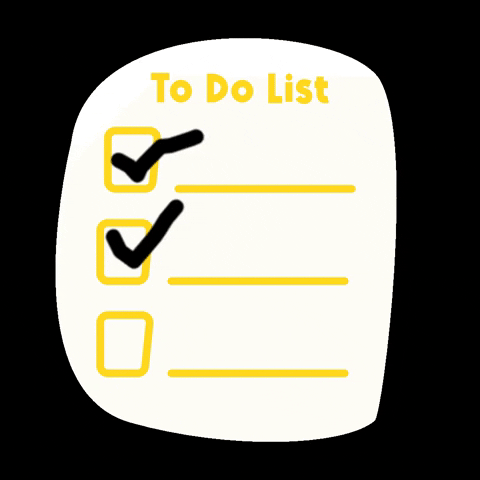

# to-Do-List

<h1> List of  things will be bone and had done daily, weekly,montly</h1>
<h2> Used Techniques : JavaScript DOM,functions,eventListeners , HTML,CSS</h2>
The work that had been completed can be removed from the list when double-clicked or press clear button. when you get with mouse on a work and click it, it will be line-through, it means that work finished
<h3>Screengif</h3>
